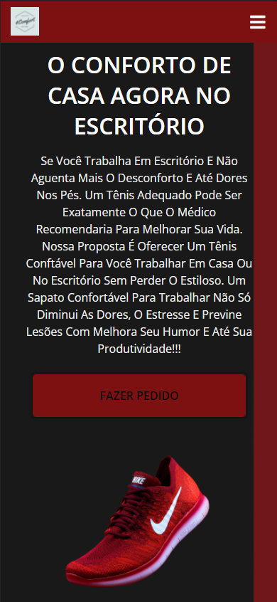
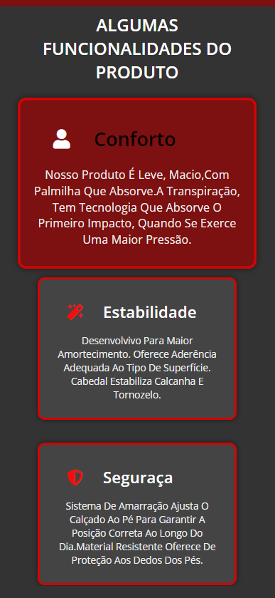
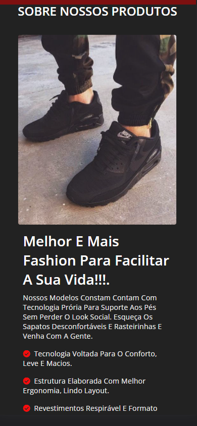
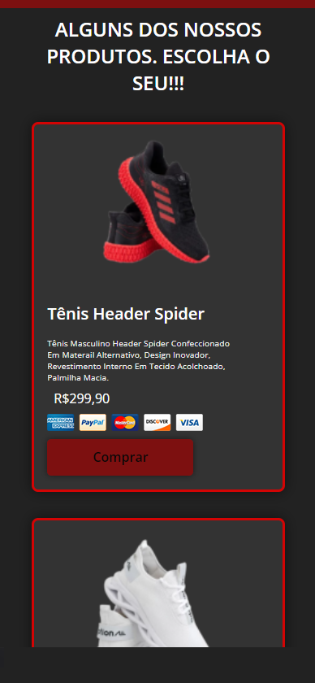
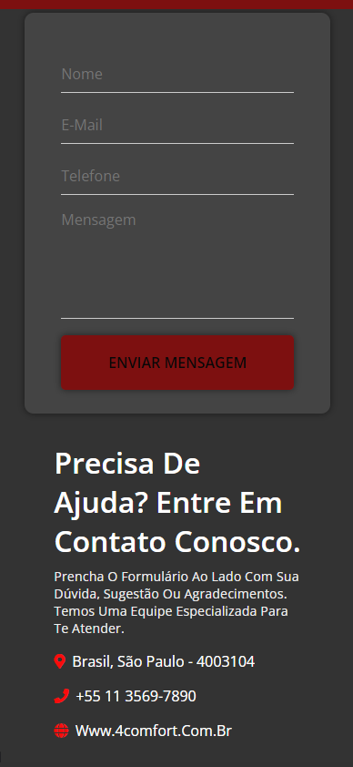
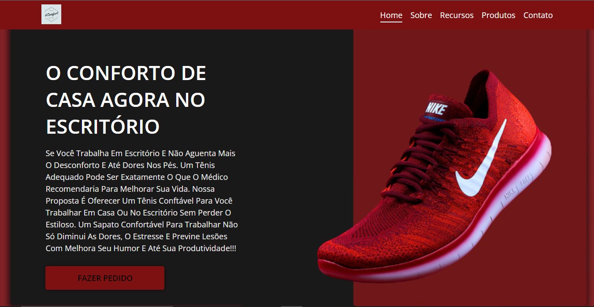
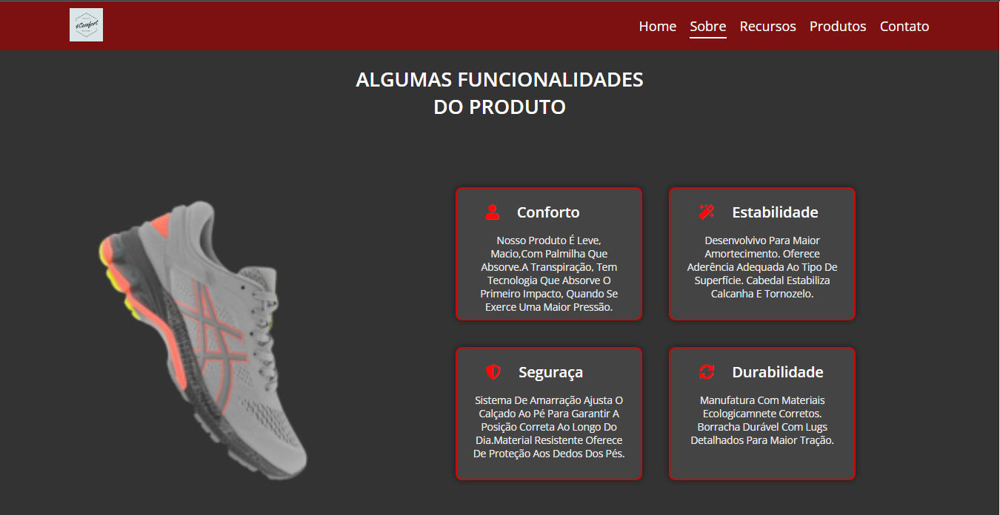
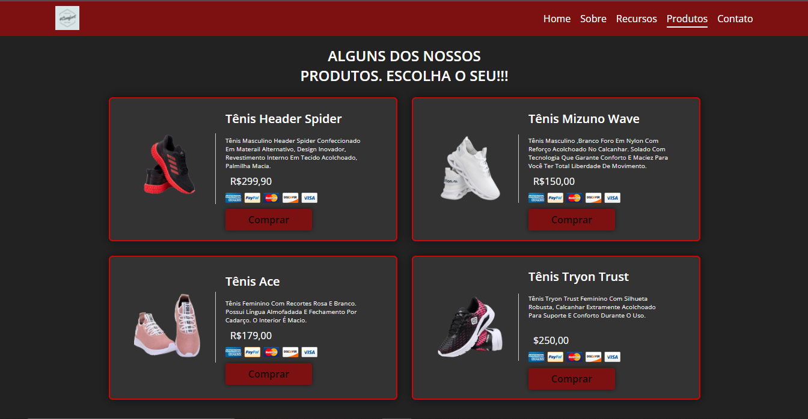
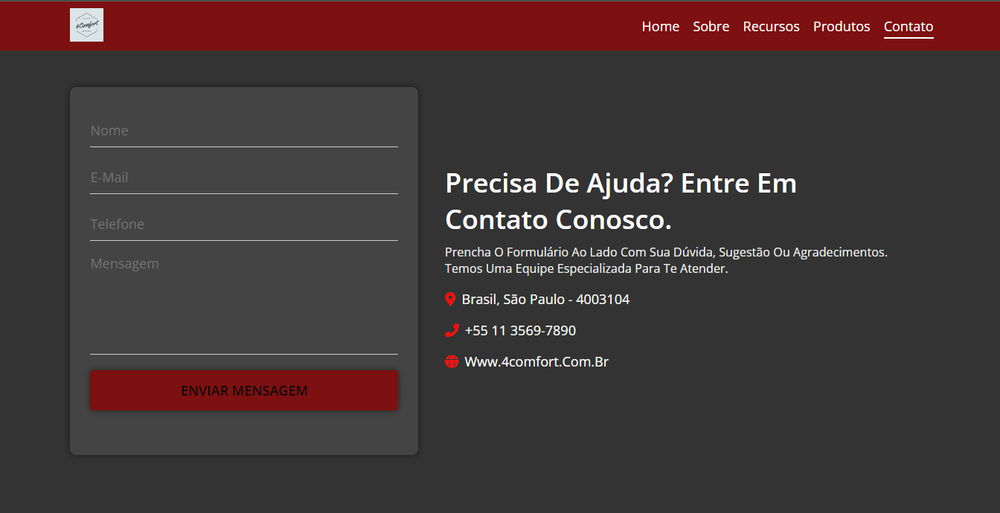

<h1 align="center">
    <br>
    <p align="center" style="color: #D30404; font-weight: bold;">🚀 Projeto Landing Page - 4Comfort
<p>
</h1>

<p align="center">

</p>

<br>

<p align="justify">4Comfort é uma empresa cuja proposta é oferecer o tênis mais confortável possível. Seguindo modelos americanos como Allbirds e Atom, o tênis é voltado para um público que trabalha em ambientes casuais (startups, empresas de tecnologia, escritórios modernos etc.) e se destaca por ser vendido exclusivamente online.</p>

<br>

<p align="justify">⚠️ Se você trabalha em escritório e não aguenta mais o desconforto e dores nos pés. Um tênis adequado pode ser exatamente o que o médico recomendaria para melhorar sua vida. Nossa proposta é oferecer um tênis confortável para você trabalhar em casa ou no escritório sem perder o estiloso. Um sapato confortável para trabalhar não só diminui as dores,o estresse e previne lesões com melhora seu humor e até sua produtividade!!!</p>

<br>

<h1>
    <br>
    <p style="color: #D30404; font-weight: bold;">🧠 Contexto</p>
</h1>

O objetivo foi criar uma landing Page de uma empresa de tênis voltado para o conforto de quem trabalha em escritório.

- Link do projeto do SURGE
- Tecnologias Utilizadas
- Arquitetura
- Requisitos
- Colaboradores!

<br>

<h1>
    <br>
    <p style="color: #D30404; font-weight: bold;">🎨 Layout</p>
</h1>

## Mobile

<p align="center">
     
     
     
     
     
</p>
</p>

---

## Web

<p align="center" style="display: flex; align-items: flex-start; justify-content: center;">
     
     
</p>
<p align="center" style="display: flex; align-items: flex-start; justify-content: center;">
     
     
</p>

<br>

<h1>
    <br>
    <p style="color: #D30404; font-weight: bold;">🔗 Link do projeto no Surge</p>
</h1>

https://flippant-surprise.surge.sh/

<h2>
    <br>
    <p style="color: #D30404; font-weight: bold;">🔗 Link do Figma</p>
</h2>

https://www.figma.com/file/xwh7b5dxXnHADEXqiAm211/Untitled?node-id=0%3A1

<br>

<h1>
    <br>
    <p style="color: #D30404; font-weight: bold;">🛠️ Tecnologias Utilizadas</p>
</h1>

 <div style="display: inline_block"><br>
 
  
  
  
   
  
 
</div>

<br>

<h1>
    <br>
    <p style="color: #D30404; font-weight: bold;">📁 Arquitetura</p>
</h1>

```
 📁 4Comfort
   |
   |- 📁 css
   |    |- 📑 style.css
   |
   |- 📁 imagens
   |    |- 📑 varias_imagem ...
   |
   |- 📁 js
   |    |- 📑 main.js
   |
   |- 📑 index.html
   |- 📑 README.md

```

<br>

<h1>
    <br>
    <p style="color: #D30404; font-weight: bold;">⚙️ Requisitos</p>
</h1>

A página deve :

- Ser responsiva no geral mas testada especificamente no iPhone 6/7/8 (essa opção é facilmente testada, usando o DevTools do Chrome) para a versão mobile. Para a versão desktop terá que ser testado em uma tela de 1280px de largura.
- Seguir semântica do HTML5, ou seja, sempre que fizer sentido usar as tags semânticas no lugar de divs. Exemplos de tags semânticas: `<header>`, `<nav>`, `<main>` , `<footer>`, entre outras.
- Links com ícone para as redes sociais (de mentirinha, pode apontar para a página inicial da rede social) contendo [Twitter](https://twitter.com/login?lang=pt), [Facebook](https://pt-br.facebook.com/) e [Instagram](https://www.instagram.com/).
- O CSS deve estar em um, ou mais, arquivo(s) separado(s) e com comentários indicando a que parte do layout as regras se referem.
- Seguir uma paleta de cores baseada na logomarca provida pelo cliente.
- Conter, **pelo menos**, 2 seções diferentes.
  - Sugestões de Seção (você **não precisa** se limitar a elas)
    - Quem somos
    - Nossos produtos/serviços
    - Contato
    - Nosso time
    - Trabalhe conosco
    - Cases de sucesso
    - Onde estamos
    - FAQ/Perguntas Frequentes
    - Promoções

<br>

<h1>
    <br>
    <p style="color: #D30404; font-weight: bold;">👨‍💻 Contribuidores</p>
</h1>

_Qualquer dúvida ou sugestão, chama no contatinho!_

<table>
  <tr>
    <td align="center"><a href="https://github.com/elisabetealves"><br /><sub><b>Elisabete Alves</b></sub></a><br /><a target="_blank" href="https://www.linkedin.com/mwlite/in/elisabete-alves-675637135">LinkedIn</a> </td>    
    <td align="center"><a href="https://github.com/CarlosToledoMartins"><br /><sub><b>Carlos Augusto</b></sub></a><br /><a target="_blank" href="https://www.linkedin.com/in/carlos-augusto-toledo-martins-5000b5a6/">LinkedIn</a> </td>    
  </tr>
  
</table>

<br>

### Feito com ❤️ e muita dedicação

<br>

<h1>
    <br>
    <p style="color: #D30404; font-weight: bold;">📝 Licença</p>
</h1>

Este projeto esta sob a licença [MIT](./LICENSE).
